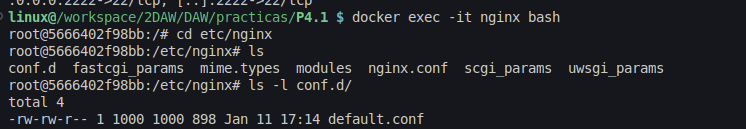
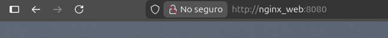
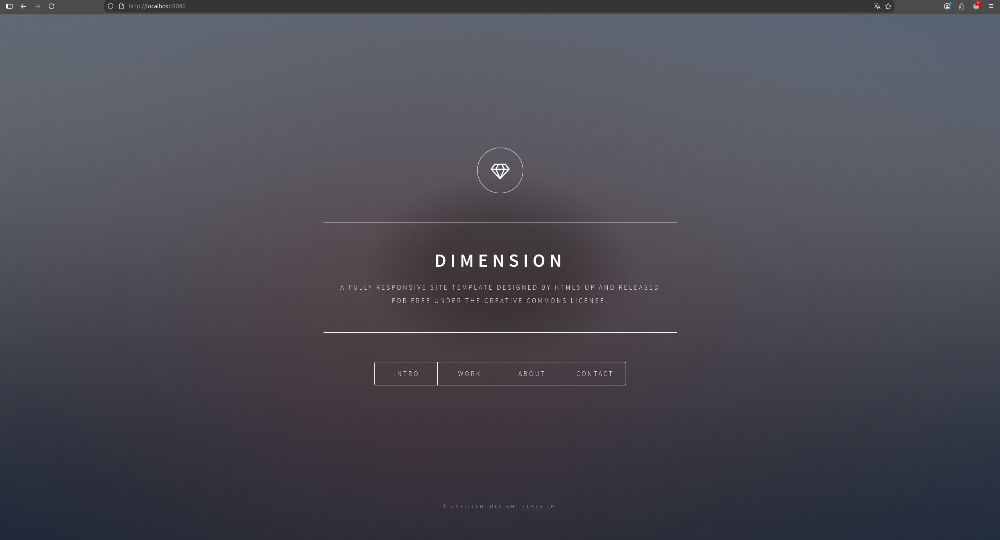
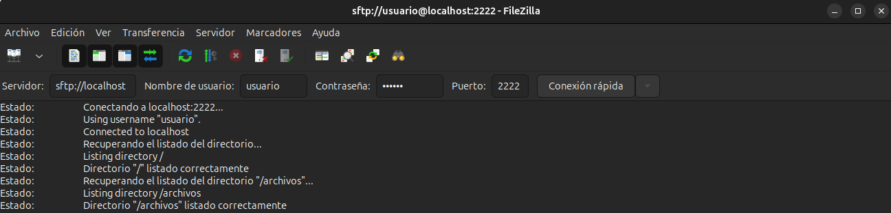
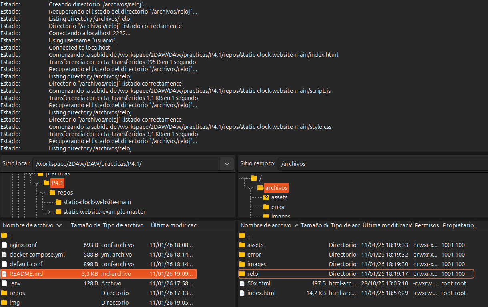
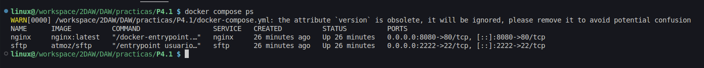
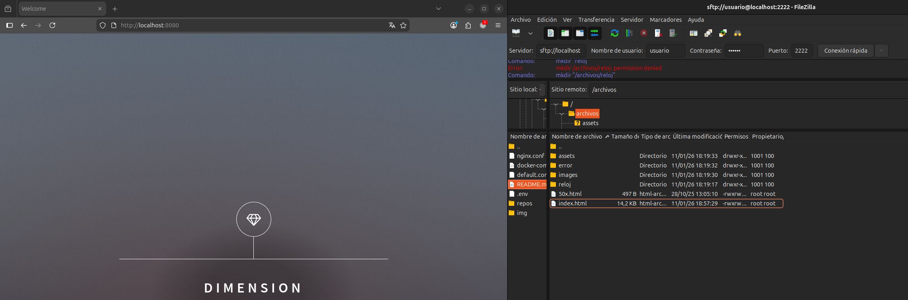
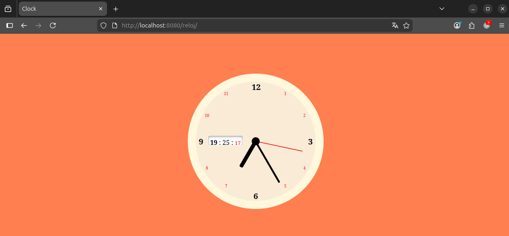
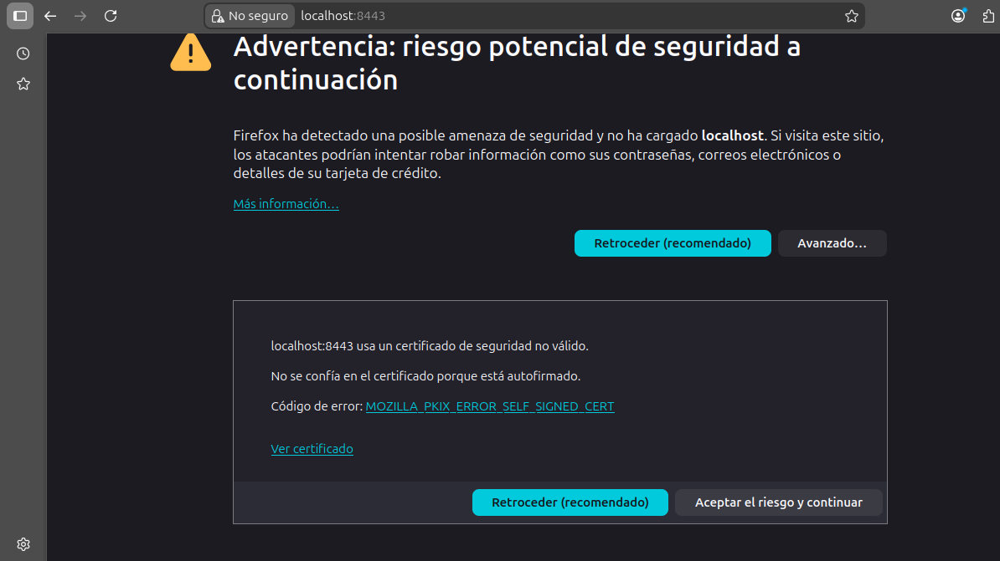
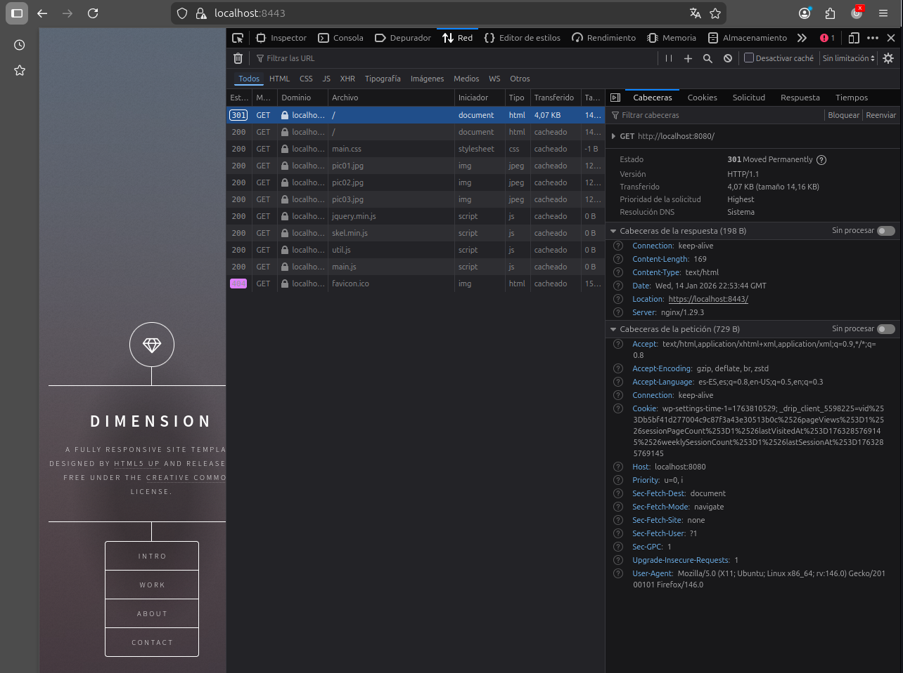

# Práctica 4.1: Instalación y configuración de servidor web Nginx

## Checklists y evidencias

### Fase 1: Instalación y Configuración

| N.º | Requisito | ¿Se cumple? | Evidencia |
|-----|-----------|-------------|-----------|
| 1 | **Servicio Nginx activo**: El servidor web está instalado y corriendo en el sistema base. | ✅ |  |
| 2 | **Configuración cargada**: Se ha cargado el archivo de configuración del sitio. | ✅ |  |
| 3 | **Resolución de nombres**: El alumno ha configurado /etc/hosts (o en Windows) para usar un nombre en vez de la IP. | ✅ |  |
| 4 | **Contenido Web**: Se visualiza la web de "Cloud Academy" en lugar de la página por defecto de Nginx. | ✅ |  |

### Fase 2: Transferencia SFTP (Filezilla)

| N.º | Requisito | ¿Se cumple? | Evidencia |
|-----|-----------|-------------|-----------|
| 5 | **Conexión SFTP exitosa**: Conexión establecida mediante claves (o usuario/pass) al servidor. | ✅ |  |
| 6 | **Permisos de escritura**: El usuario ha logrado subir archivos sin error de "Permission denied". | ✅ |  |

#### Documentación evidencias:
- **Requisito 6**: He modificado los permisos para la carpeta /archivos en el contenedor sftp de escritura y los he dado globalmente para poder subir los archivos mediante el comando `docker exec -it sftp chmod -R 777 /home/usuario/archivos`.

### Fase 3: Infraestructura Docker

| N.º | Requisito | ¿Se cumple? | Evidencia |
|-----|-----------|-------------|-----------|
| 7 | **Contenedores activos**: Nginx y SFTP están corriendo simultáneamente. | ✅ |  |
| 8 | **Persistencia (Volumen Compartido)**: Lo que se sube al SFTP se ve en la Web. | ✅ |  |
| 9 | **Despliegue Multi-sitio**: Se ha desplegado la segunda web (Reloj) en una subcarpeta. | ✅ |  |

### Evidencias requeridas:
- **Requisito 7**: Captura del comando `docker compose ps` donde se vean los dos servicios con estado Up y los puertos `0.0.0.0:8080->80/tcp` y `0.0.0.0:2222->22/tcp`.
- **Requisito 8**: Evidencia Cruzada - Una captura con Filezilla abierto a un lado (mostrando archivos en `/upload`) y el navegador al otro (mostrando `localhost:8080`), demostrando que son los mismos archivos.
- **Requisito 9**: Captura del navegador en la ruta `http://localhost:8080/reloj` mostrando el reloj funcionando.

### Fase 4: Seguridad HTTPS

| N.º | Requisito | ¿Se cumple? | Evidencia |
|-----|-----------|-------------|-----------|
| 10 | **Cifrado SSL**: El servidor responde a peticiones seguras. | ✅ |  |
| 11 | **Redirección Forzada**: HTTP redirige a HTTPS. | ✅ |  |

### Evidencias requeridas:
- **Requisito 10**: Captura del navegador accediendo por `https://...` mostrando el candado (o la alerta de certificado autofirmado) y el puerto configurado (ej. 8443).
- **Requisito 11**: Captura de la pestaña "Red" (Network) de las herramientas de desarrollador (F12) mostrando un código de estado `301 Moved Permanently` al intentar entrar por HTTP.

